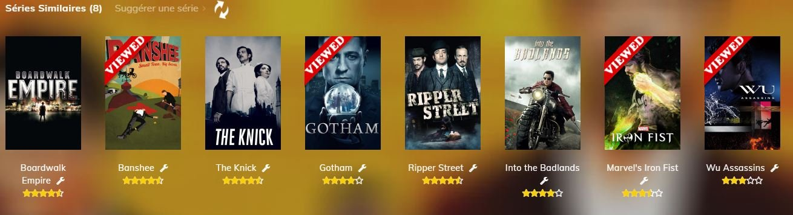

#  UserScript BetaSeries
UserScript pour le site [BetaSeries](https://www.betaseries.com/) testé avec Tampermonkey sur Chrome

## Sommaire
1. [Description](#description)
2. [Améliorations](#améliorations)
   - [Générales](#générales)
   - [Séries, Films et épisodes](#séries-films-et-épisodes)
       - [Séries et Films](#séries-et-films)
       - [Séries](#séries)
       - [Liste des séries](#liste-des-séries)
       - [Gestion des séries](#gestion-des-séries)
   - [Membres](#membres)
   - [API](#api)
3. [Corrections](#corrections)
4. [Futures améliorations possibles](#futures-améliorations-possibles)
5. [Développement](#développement)
6. [Ressources](#ressources)


## Description
Ce UserScript permet d'ajouter plusieurs améliorations et corrections au site BetaSeries.

Différentes améliorations seront ajoutées au fur et à mesure, mais vos idées (réalistes) sont les bienvenues.

## Améliorations
### Générales
* Masque les emplacements de pub
* Ajout d'une fonction d'authentification sur le site API BetaSeries, en cas de perte du token sur le site

### Séries, Films et épisodes

* Ajout du nombre de votants à la note d'une série ou d'un film ou d'un épisode


* Ajout du vote du membre connecté à la note globale de la ressource
* En mode DEV, ajout d'un bouton pour visualiser les infos de la ressource
* Ajout de la gestion du synopsis (description), pour l'afficher au complet et pour revenir à un synopsis tronqué, autant de fois que nécessaire.
* Modification de l'affichage des commentaires dans la popup (Je l'ai modifié car, à plusieurs reprises, les commentaires ne se chargeait pas dans la popup. Il fallait recharger la page :anguished:):
  - Ajout de la possibilité de naviguer entre les commentaires à l'aide des boutons **Prev** et **Next**.
  - Les spoilers ne sont pas affichés directement. Comme avant, il faut cliquer sur le lien pour afficher le message.
  - Affichage des réponses
  - TODO:
    * [X] Mieux gérer le retour d'état d'un thumb
    * [ ] Utiliser un bouton, plutôt qu'un lien, pour l'affichage d'un spoiler
    * [X] Ajouter l'écriture d'une réponse
    * [X] Gérer l'affichage de l'ensemble des commentaires
    * [ ] Gérer l'envoi de message privé directement depuis la popup
* Modification de l'affichage de la notation. Je l'ai modifié pour les mêmes raisons que les commentaires (cf ci-dessus).

#### Séries et Films

* En mode DEV, ajout d'un bouton à côté du titre d'un similar, pour visualiser ses données JSON.
* Ajoute un bandeau d'angle "Viewed" sur les séries/films similaires déjà vues (Nécessite d'être connecté à votre compte utilisateur)


* Ajout d'une popup avec les détails d'une série/film similaire lors du survol de l'image d'un similaire
* Dans la popup d'un similaire:
  * ***Film:*** Possibilité d'indiquer l'état _Vu_, _A voir_ ou _Ne veux pas voir_
  * ***Série:*** Possibilité d'ajouter la série au compte de l'utilisateur connecté
* Ajout des notes sous les titres des similaires
* Ajout du logo de classification TV dans les infos de la ressource principale (série et film)
* ~~Ajout de la récupération d'images, pour les similars, sur les sites [_thetvdb_](http://www.thetvdb.com) et [_themoviedb_](http://www.themoviedb.org), Si elles ne sont pas présentes sur [betaseries](https://www.betaseries.com).~~ Les images ne sont pas accessibles directement sur ces sites.

#### Séries

* Ajout d'une popup, au survol d'une vignette d'un épisode, pour afficher le synopsis.
* Ajout de la gestion des boutons **Ajouter**, **Archiver**, **Favoris** et **Options**. Plus besoin de recharger la page lors de l'ajout ou de la suppression d'une série.
* Ajout d'un bouton de mise à jour de tous les épisodes de la saison courante.
* Ajout d'une case à cocher "Vu" sur les vignettes des épisodes pour ajouter ou retirer l'épisode des épisodes vus. La barre de progression de la série, ainsi que l'affichage du prochain épisode à visionner, sont mis à jour en même temps que les épisodes, sans recharger toute la page.


* Ajout d'une mise à jour automatique des épisodes de la saison courante, avec réglage des options, au survol du bouton de mise à jour. Les options permettent d'activer l'update et l'intervalle de temps entre les mises à jour.


#### Films

* Ajout de la gestion du bouton **Vu**, afin d'activer la notation. La popup de notation est ouverte lorsque le film est indiqué comme vu.

#### Liste des séries

* Ajout d'un paginateur en haut de la liste des séries
* Modification du fonctionnement du filtre **pays**, sur la page des séries, pour permettre d'ajouter plusieurs pays __(Seul un pays ajouté sera retenu, si vous rafraîchissez la page)__.

#### Gestion des séries

* Ajout du statut des séries sur la page de gestion des séries de l'utilisateur connecté

### Membres

* Ajout de la fonction de comparaison entre 2 membres. Visible sur la page des autres membres, accessible via le bouton "Se comparer à ce membre" en haut du profil.
* Ajout d'un champ de recherche sur la page des amis d'un membre

### API

* Ajout d'un sommaire, sur les pages des méthodes de l'[API](https://www.betaseries.com/api/), avec les liens des différentes fonctions. Ce qui permet de voir toutes les fonctions liées aux méthodes, en début de page.


* Ajout d'améliorations sur la page de la console de l'API
  - Un bouton pour supprimer la ligne de paramètre (le paramètre _version_ ne peut être supprimé)
  - Un bouton pour vérouiller la ligne de paramètre (le paramètre _version_ est vérouillé)
  - La suppression des paramètres, hors ceux vérouillés, lors du changement de méthode
  - Un bouton pour afficher/masquer le résultat de la requête
  - Un clic sur un paramètre, dans la section __documentation__, permet d'ajouter ce paramètre directement


## Corrections

* Décode les HTMLEntities dans le titre de la série


## Futures améliorations possibles

* ~~Afficher les infos de la ressource dans une popup, lors du survol d'un similar~~
* Revoir l'affichage des commentaires, qui après un certain temps, n'arrivent plus à être chargés dans la Popup.

## Développement

* Utilisation des [Promise](https://developer.mozilla.org/fr/docs/Web/JavaScript/Reference/Global_Objects/Promise)
* Mise en cache des ressources, pour limiter les appels à l'API
* Utilisation de [**Fetch**](https://developer.mozilla.org/fr/docs/Web/API/fetch) au lieu de jQuery.Ajax
* Ajout d'une vérification de la validité du token pour certains endpoints de l'API (cf. https://www.betaseries.com/bugs/api/461). Cela concerne exclusivement le fonctionnement du userScript.
* Utilisation de classes Javascript (Cache, Note, Media, Show, Movie, Episode et Similar) pour stocker et manipuler les données en fonction du type de ressource. Plus simple aussi pour passer les données d'une fonction à une autre.
* Les classes sont développées en TypeScript et sont stockées dans ce repository.
* Utilisation de Grunt pour l'automatisation des tâches de build.

## Ressources

Les feuilles de style, les images et les scripts JS sont disponibles dans le [repository betaseries-oauth](https://github.com/Azema/betaseries-oauth).

Vous pouvez définir votre propre serveur en modifiant la constante `serverBaseUrl` en début de script.
```JavaScript
const serverBaseUrl = 'https://betaseries.example.org';

```

:warning: N'oubliez pas que votre serveur doit être sécurisé, sinon les appels ne passeront pas entre le site [betaseries](https://www.betaseries.com) et votre serveur. :warning:
